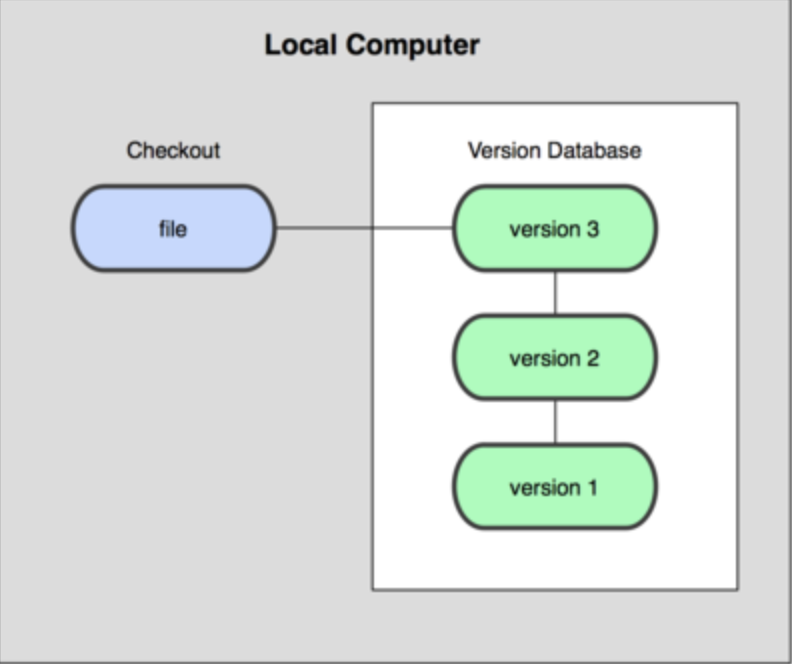
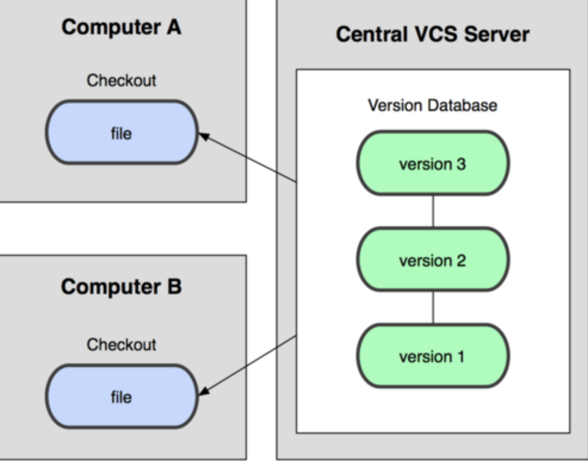

## 版本控制发展的历史

### 关于版本控制
版本控制是一种记录一个文件或者若干文件变化，以便将来查看特定版本修改情况的系统，它可以为任何类型文件进行版本控制。

### 本地版本控制系统
一开始，大家喜欢的是使用不同的文件夹保存不同版本。这种方法很简单，但是一旦弄错不可撤销，而且每个文件夹占空间比较大。为了解决这个问题，人们开发了许多的本地版本控制系统。大多采用数据库记录文件历次更新的差异（图1-1）

### 集中化的版本控制系统
接下来人们又遇到一个问题，如何让不同系统上的开发者协同工作，于是，集中化的版本控制系统Centralized Version Control Systems，简称 CVCS ，应运而生。CVCS有一服务器，记载着所有文件的修订版本。而协同工作者通过一个CVCS客户端连接到这个服务器，取出最新文件或者提交更新。

这种做法的优点就是简单，只需要管理好一个服务器的版本就行了。每个人都知道其他人在做什么管理员也可以控制每个开发人员的权限。但是这种系统缺点也很明显，就是如果服务器宕机，那么所有人都不能提交更新了，如果服务器的硬盘损坏，那么整个项目文件都有可能丢失。即使客户端保存了服务器的更新，但是不能保证有人将所有的更新拉取下来了。这种将项目的历史记录保存在一个地方的做法，肯定会有丢失的风险。

### 分布式版本控制系统
于是分布式版本控制系统（Distributed Version Control System，简称 DVCS ）面世了。

这类系统的客户端不是简单的拉取最新的更新，而是将真个版本库全部克隆下来。这样，如果服务器发生故障，那么任何一个客户端的本地仓库恢复到服务器。即使服务器宕机，每个开发人员也可以将自己的更新提交到本地仓库，等到服务器恢复后重新提交。分布式版本管理系统的每一次提取操作都是对服务器历史记录的备份。

